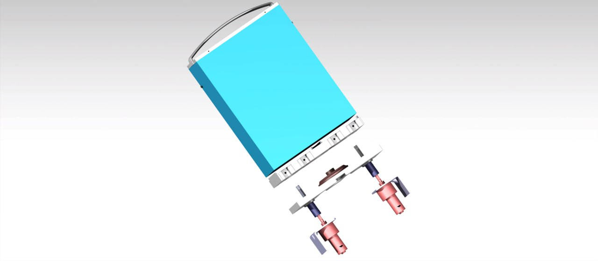
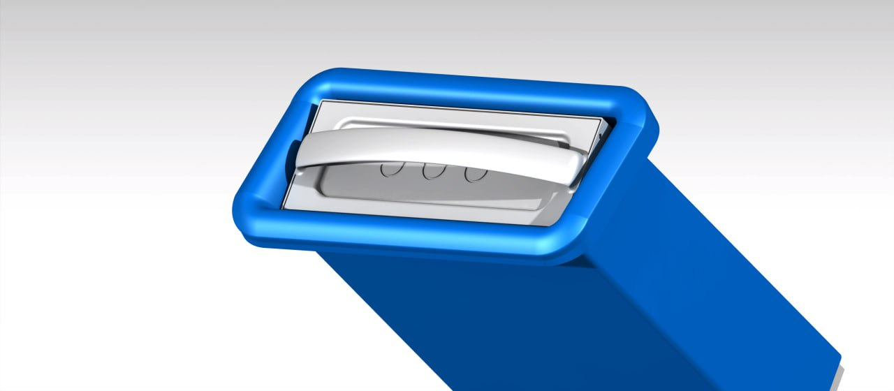
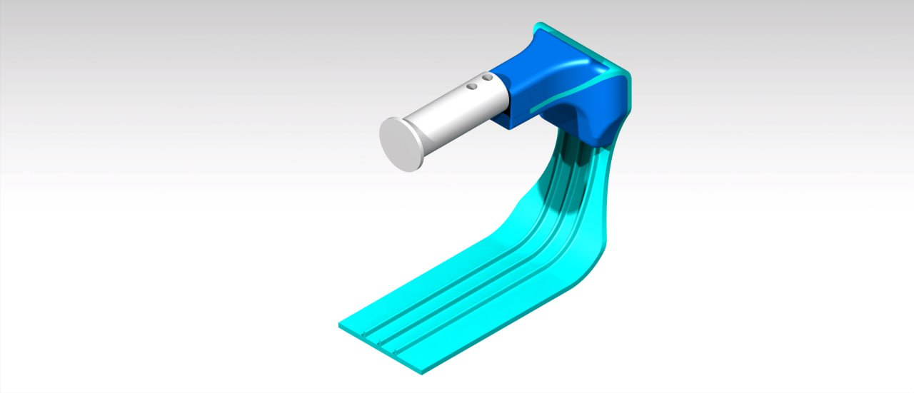
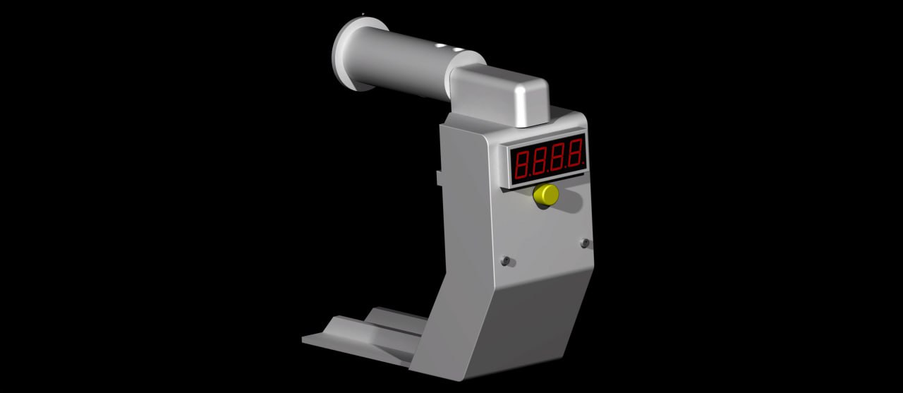
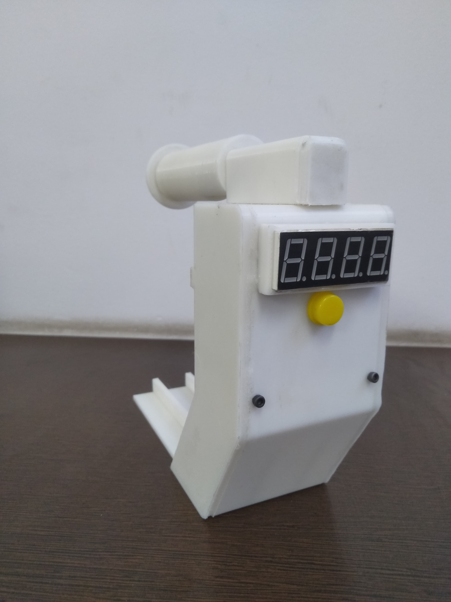
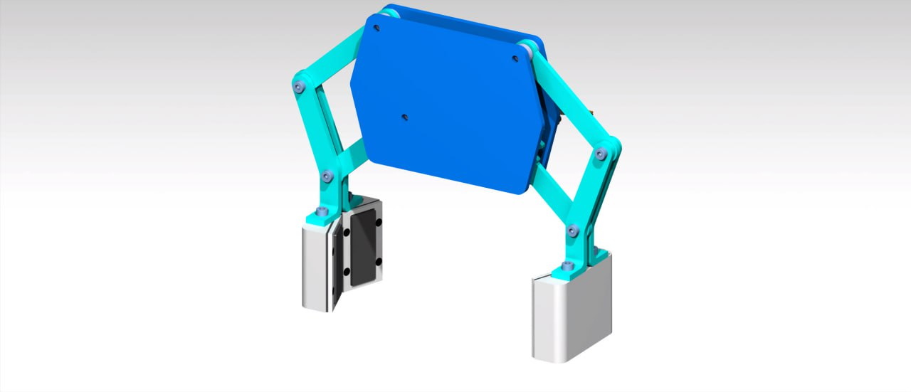

# Projects Portfolio

**Author:** Amol Satdive  
M.Tech – IITD  

This repository contains selected Product design, CAD and Prototyping related work.

---

# CAD and Prototyping Work

**Software:** CATIA V5 | Solidworks
**Focus:** Product Design | Surface Modeling | Prototyping  

---

## 1️⃣ Battery Swapping Station

- Compact modular battery swapping concept  
- Integrated locking & guiding mechanism  
- Assembly-level design with internal component layout  

  

---

## 2️⃣ Spool Holder (CAD + Prototype)

- Designed ergonomic spool holder assembly  
- CAD-to-physical prototype validation  
- 3D printed functional model  

  
  

---

## 3️⃣ Biodegradable Bowl Design

- Developed cad model of biodegradable bowl (250ml capacity) using surcafing workbench 

  
  

---

## 4️⃣ Air Sampling Robot – Gripper Mechanism

- Designed and develop prototype of dual-link gripper mechanism arm for opening and closing the the air sampler inlet and changing petri dish.
– Selection of material, plating and electronic component for the same
– Performed workspace/reachability analysis of a robotic arm end-effector using MATLAB

---

